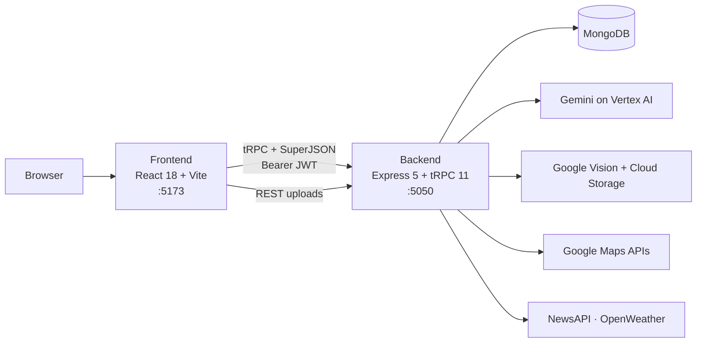

<div align="center">

# TradePilot

### _AI-powered logistics intelligence platform_

Plan routes, verify shipments, screen compliance, and catch risk — in one place.

[](https://www.typescriptlang.org/)
[](https://react.dev/)
[](https://vitejs.dev/)
[](https://expressjs.com/)
[](https://trpc.io/)
[](https://www.mongodb.com/)
[](https://tailwindcss.com/)
[-8E75B2?style=flat-square&logo=googlegemini&logoColor=white)](https://cloud.google.com/vertex-ai)

**Owner:** [Rohit Arabale](https://github.com/rohit-arabale) · **Repo:** [github.com/rohit-arabale/tradepilot](https://github.com/rohit-arabale/tradepilot)

[Run locally](#-run-locally-on-a-new-pc) · [Environment](#-environment-variables) · [Architecture](#-architecture) · [Features](#-features) · [Structure](#-project-structure) · [Troubleshooting](#-troubleshooting)

</div>

---

## Overview

TradePilot is a full-stack TypeScript monorepo for logistics operators. It combines a type-safe API
(Express 5 + tRPC 11 + MongoDB) with a React 18 frontend, and uses Gemini on Google Vertex AI for
route planning, compliance screening, visual inspection and risk analysis.

| Area | What it does |
|:--|:--|
| **Routes** | AI multimodal route options (land / sea / air) with cost, time, carbon, weather and a live map |
| **Inspect** | Verify a shipment against its manifest: camera object count, weight check, RFID tagging, tamper diff → one trust score |
| **Risk** | Per-shipment risk, anomaly scan, fraud summary and an audit trail |
| **Compliance** | AI compliance checks (HS codes, regulations) and CSV import that turns a manifest into a draft shipment |
| **Fleet** | Truck registry, fleet analytics and an AI assistant for fleet questions |
| **News context** | Live news filtered to your shipment's corridor, summarised by Gemini |

---

## 🚀 Run locally on a new PC

### 1. Install the prerequisites

| Tool | Version | Check with | Get it |
|:--|:--|:--|:--|
| Node.js | **20 LTS or 22 LTS** (avoid odd versions like 21) | `node -v` | https://nodejs.org |
| npm | 9+ (ships with Node) | `npm -v` | — |
| Git | any | `git --version` | https://git-scm.com |
| MongoDB | Atlas **or** local | — | see step 3 |

Python and Docker are **not** needed to run the app (see [YOLO service](#-optional-yolo-service)).

### 2. Get the code and install dependencies

```bash
git clone https://github.com/rohit-arabale/tradepilot.git
cd tradepilot
npm install          # installs root + backend + frontend (a postinstall hook does all three)
```

> The root install skips Puppeteer's optional browser download. The app does not use it.

### 3. Get a MongoDB database (pick one)

- **Atlas (easiest, free):** create a free cluster at https://www.mongodb.com/atlas → *Connect* →
  *Drivers* → copy the connection string. Under *Network Access* allow your IP address.
- **Local:** install MongoDB Community Server and start it, or run
  `docker run -d --name mongo -p 27017:27017 mongo:7` → use `mongodb://127.0.0.1:27017/tradepilot`.

### 4. Create the backend `.env`

For a fast local setup, `npm run quickstart` does this setup, installs dependencies if needed,
starts MongoDB in Docker when Docker is available, and launches both app services. If you use Atlas,
edit `backend/.env` first and set `MONGODB_URI` to your Atlas URL. It creates `backend/.env` and
`frontend/.env` from the examples and generates a secure JWT secret automatically.

To only generate the local env files without launching the app, run `npm run setup:env`.

For manual setup, continue below:

```bash
cd backend
cp .env.example .env          # Windows (cmd): copy .env.example .env
```

Open `backend/.env` and set the **two required values**:

```env
MONGODB_URI=mongodb://127.0.0.1:27017/tradepilot     # or your Atlas string
JWT_SECRET=<a random string, at least 32 characters>
```

Generate a secret with: `node -e "console.log(require('crypto').randomBytes(48).toString('hex'))"`

Leave `PORT=5050` and `FRONTEND_URL=http://localhost:5173` as they are. The frontend `.env` is
optional for local dev.

### 5. (Optional but recommended) load demo data

From the repo root:

```bash
cd ..                # back to the repo root if you are still in backend/
npm run seed:demo
```

This creates a demo account and ~10 sample shipments, routes, trucks, checks and audit events.
It is safe to re-run (it only resets the demo user's own records).

**Login:** `demo@gmail.com` / `abc123`

### 6. Start everything

From the repo root:

```bash
npm run dev
```

| Service | URL |
|:--|:--|
| Frontend (Vite) | http://localhost:5173 |
| Backend API | http://localhost:5050 |
| Backend health check | http://localhost:5050/ → `{"status":"ok","service":"tradepilot-backend","db":"connected"}` |

Open **http://localhost:5173**, sign in with the demo account (or register at `/createAccount`).

To run the two halves separately, use two terminals: `cd backend && npm run dev` and
`cd frontend && npm run dev`.

### What works with only the two required variables?

The app boots and you can log in, browse seeded data, manage fleet/loads and use the UI. Features that
call Google/third-party APIs need extra keys — they fail gracefully with an error message until set:

| Feature | Needs (in `backend/.env` unless noted) |
|:--|:--|
| Any Gemini-powered analysis (routes, compliance, box count, anomaly, news insights, fleet AI) | `GOOGLE_CLOUD_PROJECT`, `VERTEX_AI_LOCATION`, and `GOOGLE_APPLICATION_CREDENTIALS` (service account with *Vertex AI User*) |
| Route geocoding + directions | `GOOGLE_API_KEY` (Geocoding API + Routes API enabled) |
| Map view in the UI | `VITE_GOOGLE_API_KEY` in **`frontend/.env`** (Maps JavaScript API) |
| Weather strip on Routes | `OPENWEATHER_API_KEY` |
| News feed / news context | `NEWS_API_KEY` |
| Profile photo + product image upload | `GOOGLE_CLOUD_BUCKET_NAME` and a key file at `backend/Config/tradepilot-upload.json` |

After editing `.env`, restart `npm run dev` (the backend reads it at start-up).

---

## ⚙️ Environment variables

Full templates with comments: [`backend/.env.example`](backend/.env.example) and
[`frontend/.env.example`](frontend/.env.example).

**Backend** — required: `MONGODB_URI`, `JWT_SECRET` (≥ 32 chars). Server: `PORT` (default 5050),
`FRONTEND_URL` (CORS origin, must match the browser URL exactly), `NODE_ENV`.
Optional: `GOOGLE_CLOUD_PROJECT`, `VERTEX_AI_LOCATION`, `GOOGLE_APPLICATION_CREDENTIALS`,
`GOOGLE_APPLICATION_CREDENTIALS_JSON`, `GOOGLE_CLOUD_BUCKET_NAME`, `GOOGLE_CLOUD_CREDENTIALS_JSON`,
`GOOGLE_API_KEY`, `NEWS_API_KEY`, `OPENWEATHER_API_KEY`.

**Frontend** — all optional: `VITE_GOOGLE_API_KEY`, `VITE_API_URL`, `VITE_BACKEND_URL`.

> Never commit `.env` files or key JSON files — they are git-ignored (`backend/Config/*.json` too).

---

## 🏗️ Architecture



- **Type-safe boundary:** the frontend imports only the *type* `AppRouter` from the backend through the
  `@server/*` alias (`frontend/vite.config.ts`, `frontend/tsconfig.json`).
- **Auth:** email + password (bcrypt) → JWT stored in `localStorage` and sent as `Authorization: Bearer`.
- **Legacy REST** (`backend/src/legacy/`) exists only for multipart uploads: `POST /api/user/upload-photo`
  and `POST /api/analyze-product`.
- **Boot guards:** the server exits immediately if `MONGODB_URI` / `JWT_SECRET` are missing or the
  database is unreachable, and shuts down gracefully on SIGTERM/SIGINT.

---

## ✨ Features

Routes in the app (all except `/` and `/createAccount` require login):

| Route | Page |
|:--|:--|
| `/` , `/createAccount` | Sign in / register |
| `/dashboard` | Overview and entry to every workflow |
| `/inspect` | Physical inspection — tabs: Camera · Weight Check · RFID Tagging · Tamper Diff, with a trust gauge |
| `/risk` | Risk Center — shipment risk, anomaly scan, audit trail |
| `/routes` | Route Planning — AI route options with cost / time / carbon, weather, map, latest tracking |
| `/fleet` | Fleet — register / list / remove trucks, analytics, AI assistant |
| `/compliance` | Compliance — AI checks, HS codes, CSV import |
| `/profile` | Account, history and analysis |

> **Status note:** the backend also exposes APIs that have no page wired into `App.tsx` yet —
> load matching (`loadMatch`), product-image analysis (`/api/analyze-product`), inventory drafts and PDF
> export. Their page components exist in `frontend/src/pages/{inventory,compliance,fleet}/` but are not
> routed. See `unified.txt` for the consolidation plan.

---

## 📚 Tech stack

| Layer | Technologies |
|:--|:--|
| Frontend | React 18, Vite 6, TypeScript, Tailwind CSS v4, React Router 7, TanStack Query 5, tRPC client, Framer Motion, Recharts, lucide-react, Google Maps JS loader, `@react-pdf/renderer`, PapaParse, cobe (globe) |
| Backend | Node.js, Express 5, tRPC 11, Mongoose 8, Zod 4, SuperJSON, JWT + bcrypt, `@google/genai` (Vertex AI), Google Vision, Google Cloud Storage, Axios, Multer |
| Optional | FastAPI + Ultralytics YOLO11 microservice (`yolo/`) |

---

## 📁 Project structure

```
tradepilot/
├── backend/                     # Express 5 + tRPC 11 API
│   └── src/
│       ├── index.ts             # Entry: env guard, CORS, /trpc, legacy REST, shutdown
│       ├── trpc.ts · context.ts # tRPC init, JWT → ctx.user
│       ├── routers/             # auth, inventory, compliance, logistics, boxCount, shipmentDiff,
│       │                        # loadMatch, tracking, anomaly, rfid, weightCheck, fraud, trucks,
│       │                        # audit, insights, newsContext  (+ _app.ts root)
│       ├── models/              # Mongoose schemas (User, Draft, SaveRoute, Truck, …)
│       ├── legacy/              # multipart-upload REST routes
│       ├── lib/ · utils/        # db, genai (Vertex), auth helpers, geocode
│       └── scripts/             # seed-demo, seed-demo-routes, verify-demo
├── frontend/                    # React 18 + Vite app
│   ├── index.html · vite.config.ts
│   └── src/
│       ├── App.tsx · main.tsx   # routes + entry
│       ├── pages/               # auth, dashboard, inspect, risk, routes, fleet, compliance, profile, …
│       ├── components/          # NavBar, TrustGauge, InsightsRail, NewsContextCard, skeletons, …
│       └── lib/                 # trpc client + provider
├── yolo/                        # optional FastAPI + YOLO11 service
├── docker-compose.yml           # runs the YOLO service only
├── render.yaml                  # Render (backend) blueprint
└── .github/workflows/deploy.yml # CI/CD (Vercel + SSH VM)
```

---

## 🛠️ Development

| Where | Command | Purpose |
|:--|:--|:--|
| root | `npm run dev` | backend + frontend with hot reload |
| root | `npm run build` | production build of both |
| root | `npm start` | run the built backend + `vite preview` |
| root | `npm run seed:demo` | load demo data |
| `backend/` | `npm run seed:demo-routes` | pre-warm the AI route cache (needs Gemini + Maps keys) |
| `backend/` | `npx tsc --noEmit` | type-check |
| `frontend/` | `npm run lint` · `npx tsc --noEmit` | lint / type-check |

> **ESM note:** the backend is `"type": "module"` with NodeNext resolution — relative imports must end in
> `.js` (e.g. `import db from "./lib/db.js"`), even though the source files are `.ts`.

---

## 🐍 Optional YOLO service

`yolo/` is a standalone FastAPI + Ultralytics YOLO11n detector (`/detect`, `/detect-and-crop`, `/crop`,
`/health`). The current UI's Box Count tab uses Gemini vision through tRPC and does **not** call this
service, so you can ignore it. To run it anyway:

```bash
docker compose up yolo --build          # http://localhost:8000
# or:  cd yolo && python -m venv .venv && source .venv/bin/activate \
#      && pip install -r requirements.txt && uvicorn main:app --port 8000
```

The Vite dev server proxies `/yolo/*` → `http://localhost:8000`.

---

## 🚢 Deployment

- **Backend:** `render.yaml` (Render) — set `MONGODB_URI`, `JWT_SECRET`, `FRONTEND_URL`,
  `GOOGLE_CLOUD_PROJECT`, `GOOGLE_APPLICATION_CREDENTIALS_JSON`, `GOOGLE_CLOUD_CREDENTIALS_JSON`
  in the dashboard. In production `FRONTEND_URL` is mandatory.
- **Frontend:** Vercel (`frontend/vercel.json`) — set `VITE_API_URL` to your backend URL. Without it, a
  production build falls back to `https://tradepilot.duckdns.org`.
- **CI/CD:** `.github/workflows/deploy.yml` deploys on push to `main`. Add these repository secrets:
  `VERCEL_TOKEN`, `VERCEL_ORG_ID`, `VERCEL_PROJECT_ID`, `SSH_PRIVATE_KEY`, `VM_USER`. The VM step expects
  a systemd unit named `tradepilot-backend.service`, the repo in `/home/<VM_USER>/app`, and the SPA served
  from `/var/www/tradepilot`.

---

## 🧯 Troubleshooting

| Symptom | Cause / fix |
|:--|:--|
| Backend exits: `JWT_SECRET environment variable must be set` or `required env var "MONGODB_URI" is not set` | `backend/.env` missing or misnamed — it must be exactly `backend/.env` |
| Every request fails with `JWT_SECRET must be at least 32 characters long` | Use a longer secret (see step 4) |
| `MongoDB connection failed: ECONNREFUSED` | MongoDB isn't running, or (Atlas) your IP isn't allow-listed |
| Browser console: CORS error | `FRONTEND_URL` must equal the browser origin exactly: `http://localhost:5173` (not `127.0.0.1`). If port 5173 was busy Vite switches to 5174 — free 5173 or update `FRONTEND_URL` |
| UI loads but every call fails / “Network Error” | Backend not running, or `PORT` ≠ 5050 without setting `VITE_API_URL` |
| AI features say `GOOGLE_CLOUD_PROJECT is not set` or credentials errors | Configure Vertex AI (table above). Leave `GOOGLE_APPLICATION_CREDENTIALS_JSON` unset unless it is real JSON |
| `Google Cloud credentials file not found` warning on start | Harmless unless you use photo / product-image upload (`backend/Config/tradepilot-upload.json`) |
| Map shows “VITE_GOOGLE_API_KEY missing” | Add it to `frontend/.env`, restart the frontend |
| `npm install` hangs on puppeteer | Use `PUPPETEER_SKIP_DOWNLOAD=1` (see step 2) |

---

## 📄 License & ownership

© 2026 **Rohit Arabale**. All rights reserved.

Maintained by [@rohit-arabale](https://github.com/rohit-arabale) — [github.com/rohit-arabale/tradepilot](https://github.com/rohit-arabale/tradepilot)
